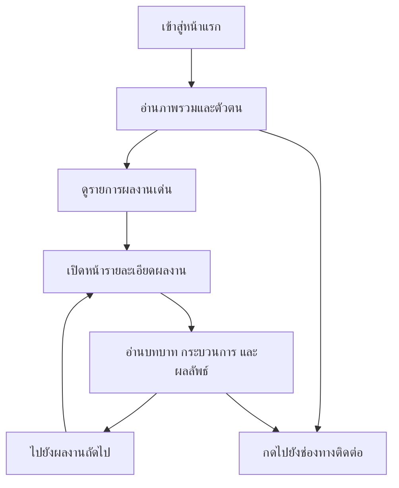

## 1. ภาพรวมผลิตภัณฑ์
เว็บไซต์พอร์ตโฟลิโอส่วนตัวของ Panusbodee สำหรับนำเสนอประสบการณ์ ผลงานเด่น วิธีคิด และช่องทางติดต่อในรูปแบบที่ดูพรีเมียม สงบ และน่าเชื่อถือ
- เป้าหมายหลักคือทำให้ผู้ว่าจ้าง ลูกค้า หรือผู้ร่วมงานเข้าใจตัวตน จุดแข็ง และผลงานได้ภายในเวลาอันสั้น พร้อมมีเส้นทางไปยังผลงานเชิงลึกและช่องทางติดต่อที่ชัดเจน
- คุณค่าของเว็บไซต์คือยกระดับภาพลักษณ์ส่วนบุคคลให้ดูมีรสนิยมและมืออาชีพมากกว่าพอร์ตเดิม โดยคงความเป็นมนุษย์และความอบอุ่นไว้

## 2. ฟีเจอร์หลัก

### 2.1 โมดูลหลักของผลิตภัณฑ์
1. **หน้าแรก**: hero statement, intro, selected works, profile summary, contact entry points
2. **หน้ารายละเอียดผลงาน**: project story, role, outcome, process, gallery, next project navigation

### 2.2 รายละเอียดหน้า
| ชื่อหน้า | ชื่อโมดูล | คำอธิบายฟีเจอร์ |
|----------|-----------|------------------|
| หน้าแรก | Hero Section | แสดงชื่อ บทบาทหลัก tagline และปุ่มนำทางไปยังผลงานและช่องทางติดต่อ |
| หน้าแรก | Navigation | เมนูด้านบนแบบเรียบหรู พร้อม anchor navigation ไปยังส่วนสำคัญ |
| หน้าแรก | About Summary | สรุปตัวตน วิธีทำงาน และแนวคิดการออกแบบ/การจัดการโปรเจกต์ |
| หน้าแรก | Selected Works | แสดงผลงานเด่น 5-6 ชิ้นจากพอร์ตเดิม พร้อมภาพรวมสั้นและลิงก์ไปหน้ารายละเอียด |
| หน้าแรก | Links & Contact | รวม Instagram, LinkedIn, Canva, Drive และช่องทางติดต่องาน |
| หน้าแรก | Notes / Interests | พื้นที่เล็กสำหรับมุมมองส่วนตัวหรือสิ่งที่สนใจ เพื่อให้เว็บไซต์มี character |
| หน้ารายละเอียดผลงาน | Project Header | แสดงชื่อโปรเจกต์ บทบาท ประเภทงาน และสรุปสั้น |
| หน้ารายละเอียดผลงาน | Case Study Blocks | เล่า problem, role, process, deliverables, outcome เป็น sections ต่อเนื่อง |
| หน้ารายละเอียดผลงาน | Visual Gallery | แสดงภาพ mockup หรือภาพประกอบในรูปแบบ immersive scroll |
| หน้ารายละเอียดผลงาน | Project Navigation | ลิงก์กลับหน้าแรกและปุ่มไปงานถัดไป/ก่อนหน้า |

## 3. กระบวนการหลัก
ผู้เข้าชมเข้าหน้าแรก รับรู้ positioning และตัวตนของเจ้าของพอร์ต จากนั้นเลือกอ่านผลงานเด่นหรือกดไปยังช่องทางติดต่อได้ทันที
หากสนใจงานใดเป็นพิเศษ ผู้ใช้จะเข้าสู่หน้ารายละเอียดเพื่อดูบทบาท วิธีคิด และผลลัพธ์เชิงลึก ก่อนย้อนกลับไปสำรวจงานอื่นหรือกดติดต่อ

## 4. การออกแบบส่วนติดต่อผู้ใช้
### 4.1 สไตล์การออกแบบ
- โทนภาพรวม: editorial minimal + quiet luxury + intelligent motion
- สีหลัก: warm ivory, charcoal, soft graphite
- สีเน้น: muted bronze / champagne gold สำหรับเส้นขอบ เส้นแบ่ง และ focus state
- ปุ่ม: ทรงเรียบ ขอบบาง มุมโค้งเล็ก เอฟเฟกต์ hover แบบยกตัวเบาๆ และเปลี่ยนพื้นผิว
- ตัวอักษร: ฟอนต์ display มีเอกลักษณ์สำหรับหัวเรื่อง จับคู่กับ serif หรือ sans ที่อ่านสบายสำหรับเนื้อหา
- Layout: desktop-first, spacious, grid-based แต่มีการ break grid บางส่วนเพื่อให้ดูเหมือนงาน editorial
- Icon style: ใช้เส้นบาง เรียบ และหลีกเลี่ยง icon ที่ดูสำเร็จรูปเกินไป
- Motion: reveal-on-scroll, parallax เบามาก, text stagger, image mask transition และ hover details ที่สุขุม

### 4.2 ภาพรวมการออกแบบรายหน้า
| ชื่อหน้า | ชื่อโมดูล | องค์ประกอบ UI |
|----------|-----------|----------------|
| หน้าแรก | Hero Section | ชื่อขนาดใหญ่, subtitle หลายบรรทัด, เส้นแบ่ง, background texture แบบ grain เบาๆ, animation เปิดหน้าแบบ stagger |
| หน้าแรก | Selected Works | การ์ดงานแนวกองบรรณาธิการ ใช้ภาพใหญ่ ข้อความน้อย แต่ลำดับชั้นชัด |
| หน้าแรก | About Summary | คอลัมน์ข้อความอ่านง่าย สลับกับ quote หรือ note block ที่เพิ่ม character |
| หน้าแรก | Links & Contact | ปุ่มลิงก์แบบ understated พร้อม focus และ hover state ที่หรู |
| หน้ารายละเอียดผลงาน | Project Header | typography เด่น + metadata line สำหรับ role / year / category |
| หน้ารายละเอียดผลงาน | Case Study Blocks | section ยาวที่มี rhythm ชัดเจน ใช้ heading และ divider ช่วยการอ่าน |
| หน้ารายละเอียดผลงาน | Visual Gallery | ภาพเต็มความกว้าง สลับกับกริดภาพเพื่อสร้าง pacing |

### 4.3 การตอบสนองต่อหน้าจอ
- ออกแบบแบบ desktop-first เพื่อให้พอร์ตดูพรีเมียมบนจอแล็ปท็อปและเดสก์ท็อป
- รองรับ tablet และ mobile ด้วยการยุบ grid, ลดขนาดตัวอักษรแบบเป็นขั้น และปรับ spacing ให้ยังดูหรูไม่อึดอัด
- ปุ่ม ลิงก์ และพื้นที่กดต้องเหมาะกับการสัมผัสบนมือถือ
- Motion ต้องลดระดับอัตโนมัติเมื่อผู้ใช้ตั้งค่า reduced motion
