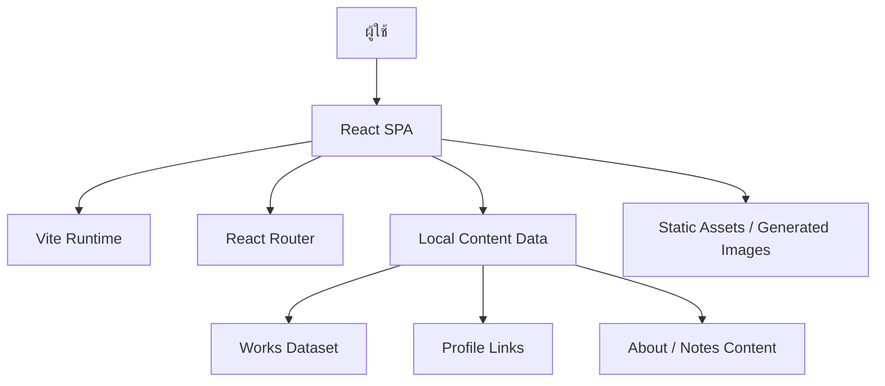
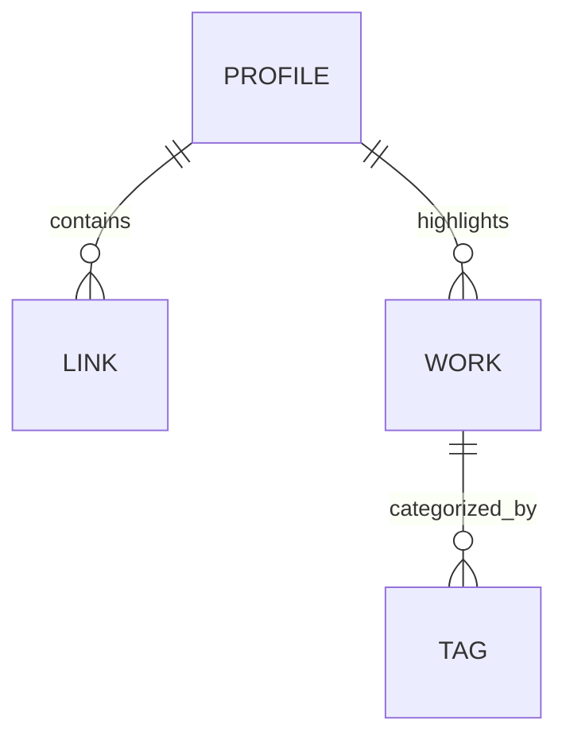

## 1. การออกแบบสถาปัตยกรรม


## 2. คำอธิบายเทคโนโลยี
- Frontend: React 18 + TypeScript + Vite
- Styling: Tailwind CSS 3 + CSS variables สำหรับ design tokens + utility classes สำหรับ layout และ motion
- Routing: React Router สำหรับหน้าแรกและหน้ารายละเอียดผลงานแบบ dynamic route
- State: ใช้ local state และ static data เป็นหลัก ไม่เพิ่ม global state ที่ไม่จำเป็น
- Content Strategy: เก็บข้อมูลโปรไฟล์ รายการผลงาน และลิงก์ต่างๆ ในไฟล์ข้อมูลภายในโปรเจกต์เพื่อให้แก้ไขง่าย
- Assets: ใช้ภาพจาก text-to-image endpoint ตามข้อกำหนด และเตรียมโครงให้สามารถแทนที่ด้วยภาพจริงในภายหลังได้
- Backend: ไม่มีในระยะแรก
- Database: ไม่มี ใช้ mock/static content
- Initialization Tool: Vite

## 3. นิยามเส้นทาง
| เส้นทาง | วัตถุประสงค์ |
|--------|---------------|
| / | หน้าแรกสำหรับแนะนำตัว แสดงผลงานเด่น และช่องทางติดต่อ |
| /works/:slug | หน้ารายละเอียดผลงานแต่ละชิ้น |

## 4. นิยาม API
ไม่มี backend API ในเวอร์ชันแรก โดยใช้ static content ภายในแอป

```ts
export type PortfolioLink = {
  label: string
  href: string
}

export type WorkItem = {
  slug: string
  title: string
  category: string
  role: string
  year: string
  summary: string
  challenge: string
  approach: string
  outcome: string
  tags: string[]
  image: string
}
```

## 5. โครงสร้างฝั่งไคลเอนต์
- `src/main.tsx`: entry point ของแอป
- `src/App.tsx`: นิยาม route หลักและ layout ระดับบน
- `src/pages/HomePage.tsx`: หน้าแรก
- `src/pages/WorkDetailPage.tsx`: หน้ารายละเอียดผลงาน
- `src/components/`: เก็บ section และ UI component ที่ใช้ซ้ำ
- `src/data/portfolio.ts`: เก็บข้อมูลเจ้าของพอร์ต ลิงก์ และรายการผลงาน
- `src/styles/`: เก็บ global styles และ token เพิ่มเติมถ้าจำเป็น

## 6. แบบจำลองข้อมูล
### 6.1 โครงสร้างข้อมูลเชิงแนวคิด


### 6.2 หลักการจัดการข้อมูล
- ใช้ static typed objects แทนฐานข้อมูลเพื่อความเร็วในการพัฒนาและ deployment
- ออกแบบ schema ให้เพิ่ม/ลดผลงานได้ง่ายโดยไม่แตะ logic หลัก
- รองรับการเชื่อม CMS หรือ backend ในอนาคตผ่าน data adapter ถ้าต้องการ

## 7. ข้อกำหนดด้านคุณภาพ
- Performance: เน้นโหลดเร็วด้วย static rendering จากฝั่ง client, asset ที่บีบอัดแล้ว, animation ที่ใช้ GPU-friendly properties
- Accessibility: semantic heading, contrast ที่เพียงพอ, keyboard navigation, reduced-motion support
- Maintainability: แยก data ออกจาก presentation, สร้าง component reusable ตาม section หลัก
- Responsiveness: desktop-first พร้อม breakpoint สำหรับ tablet และ mobile
